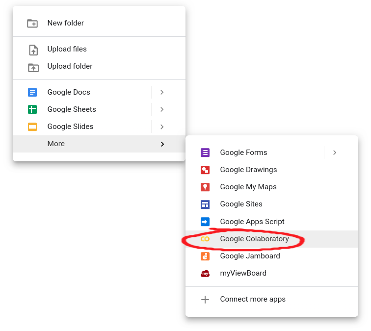
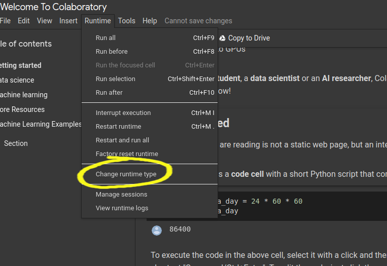

# How to Set up a Deep Learning Environment
This article gives detailed instructions on how to set up a deep learning environment.

TensorFlow (TF), developed by Google Brain, is the most well-known library used in production for deep learning models and it has a very large community. However, TensorFlow has a steep learning curve. On the other hand, Keras is a high-level API built on top of TensorFlow. It is more user-friendly and easy to use compared to TF, and you can familiarize yourself more quickly because it’s more “pythonic”. So why not just use Keras alone? You can. But in case you want to have more control over your model network, have access to better debugging, or develop novel networks and conduct some deep learning research in the future, TensorFlow is the way.

In this tutorial, we will help you set up a TensorFlow deep learning environment. Keras API is included in TensorFlow, but you can also download and use it separately.

## Some considerations before installing: using GPU or not
A Graphics Processing Unit (GPU) is a microprocessing chip designed to handle graphics in computing environments and can have many more cores than a [Central Processing Unit (CPU)](https://www.codecademy.com/resources/blog/what-is-a-cpu/). More cores of GPUs allow for the better computation of multiple parallel processes. If you have access to GPU, how can you use it?

On your computer, if you installed TensorFlow using p`ip, the newest version will have the GPU support. For releases 1.15 and older, CPU and GPU packages are separate.

`pip install tensorflow` for CPU

`pip install tensorflow-gpu` for GPU

However, it is not that simple since you need to also install some NVIDIA® software requirements. We suggest following [TensorFlow’s installation instructions](https://www.tensorflow.org/install/gpu) for GPU support.

## Different ways to using TensorFlow
There are multiple ways for you to run deep learning algorithms using TensorFlow:

1. **(Easy-breezy) Use Google Colaboratory (Colab)**. This is the easiest option for some initial exploration. No installation is necessary - run TensorFlow code directly in the browser with Colaboratory, Google’s Jupyter Notebook environment that requires no setup to use and runs entirely in the cloud. There are two ways to start a Colaboratory notebook:
– Visit [Colab](https://colab.research.google.com/notebooks/welcome.ipynb)

– From your Google Drive: _Right Mouse Click_ > _More_ > _Colaboratory_ to start a new Colab Notebook.


Switching to using a GPU is easy in Colaboratory. In _Runtime_ > _Change runtime type_, select GPU, and there you are. You even have access to a special Tensor Processing Unit (TPU), an application-specific circuit developed by Google specifically for neural network machine learning.




1. __Your computer, your rules.__ To install TensorFlow on your computer, you first need to have Python installed (version 3.5–3.8) and a Python’s package manager _pip_ (version >19.0.), which should have come with your Python version. TensorFlow is installed in the same way as any other package you add to your Python. It’s always good to install new large packages in a virtual environment to keep it separate from your base distribution and we will provide commands for that as well.

(Suggested) Installing with [pip](https://www.tensorflow.org/install/pip#ubuntu-mac-os):

```
Create a virtual environment with _venv_ (install it if needed):
 
``python3 -m venv my_tensorflow``
 
Activate the virtual environment
 
``source my_tensorflow/bin/activate``
 
First upgrade pip:
 
``pip install --upgrade pip``
 
Use _pip_ to install TensorFlow in your virtual environment:
 
``pip install --upgrade tensorflow``
```

Note: with the new versions of TF (version > 2.0) by installing with pip, you don’t need to specifically install the GPU supported version: _tensorflow-gpu_.

The procedure with [Anaconda/Miniconda](https://docs.anaconda.com/anaconda/user-guide/tasks/tensorflow/):
```
Create a virtual environment using the following command: 
 
`conda create -n my_tensorflow` (instead of _my_tensorflow_ you can give any name)
 
Activate the environment

`conda activate my_tensorflow`

Now that you are in `my_tensorflow` virtual environment you can download TensorFlow (for CPU) with:

`conda install -c anaconda tensorflow`

If you wish to use  TensorFlow with GPU support use:
 
`conda install -c anaconda tensorflow-gpu`
```

You can complete the steps above in Anaconda Navigator which provides a Graphical User Interface (GUI) if you don’t want to use the command line. Be careful about the distinction between the CPU and GPU version when using Anaconda.

1. __Takes some footwork: use Docker.__ Docker is a software platform for building applications based on containers — small and lightweight execution environments that make shared use of the operating system kernel but otherwise run in isolation from one another. For this, you need to install Docker on your machine. Depending on your operating system, [procedures can differ](https://docs.docker.com/engine/install/). Using Docker is the easiest way to set up GPU support.

## How to check if you successfully downloaded TensorFlow?
You can test your installation by entering Python’s interactive mode and typing the following code:

```python
import tensorflow as tf
print(tf.__version__) #will print the version of your TensorFlow
```

The community often uses `tf` as a module handle, and by also using it will enable you to copy-paste some code from the Internet as you are learning, and it will already be compatible with your import handle.

## How to access the functionalities of Keras?
As we mentioned, Keras is built on top of TensorFlow. You can access its functionalities directly if you install the Keras Python package:

```py
import keras
```
or through TensorFlow:

```py
from tensorflow import keras
```