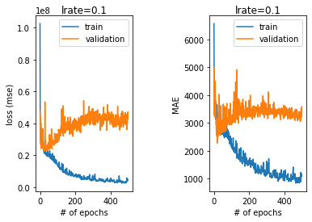
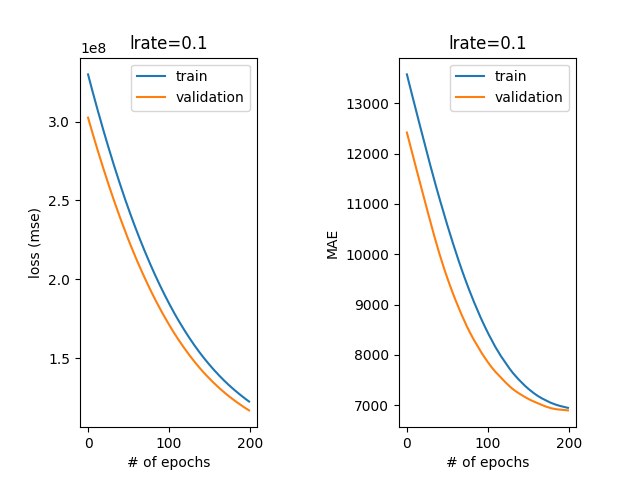
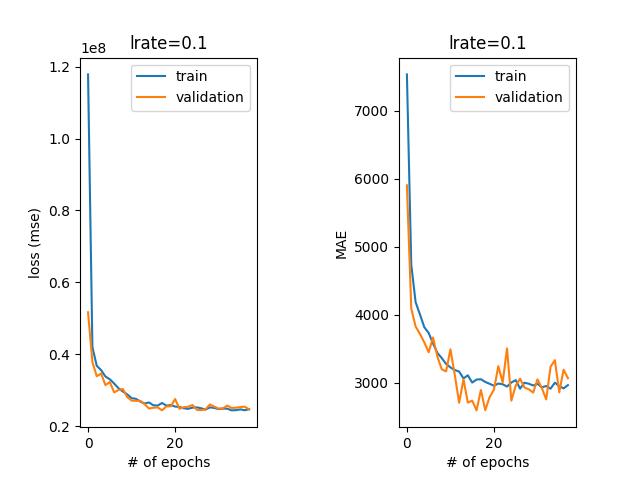
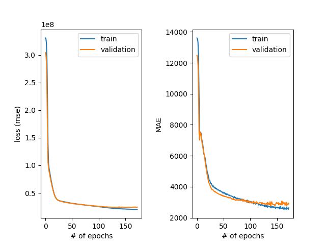
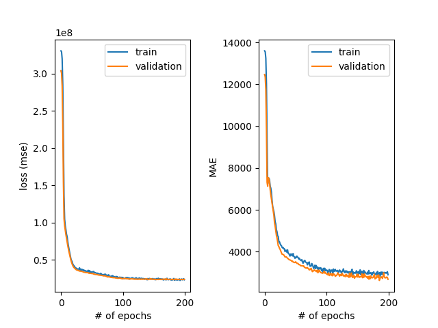

# Fitting examples
## Batch Size
The batch size is a hyperparameter that determines how many training samples are seen before updating the 
network’s parameters (weight and bias matrices).

When the batch contains all the training examples, the process is called batch gradient descent. 
If the batch has one sample, it is called the stochastic gradient descent. And finally, when 1 < batch size < number
of training points, is called mini-batch gradient descent. An advantage of using batches is for GPU computation that 
can parallelize neural network computations.

How do we choose the batch size for our model? On one hand, a larger batch size will provide our model with better 
gradient estimates and a solution close to the optimum, but this comes at a cost of computational efficiency and 
good generalization performance. On the other hand, smaller batch size is a poor estimate of the gradient, but 
the learning is performed faster. Finding the “sweet spot” depends on the dataset and the problem, and can be 
determined through hyperparameter tuning.

For this experiment, we fix the learning rate to 0.01 and try the following batch sizes: 1, 2, 10, and 16. Notice 
how small batch sizes have a larger variance (more oscillation in the learning curve).

Want to improve the performance with a larger batch size? A good trick is to increase the learning rate!

## Batch Size Further Explanation
For instance, let's say you have 1050 training samples and you want to set up a `batch_size` equal to 100. The algorithm takes the first 100 samples (from 1st to 100th) from the training dataset and trains the network. Next, it takes the second 100 samples (from 101st to 200th) and trains the network again. We can keep doing this procedure until we have propagated all samples through of the network. Problem might happen with the last set of samples. In our example, we've used 1050 which is not divisible by 100 without remainder. The simplest solution is just to get the final 50 samples and train the network.

Advantages of using a batch size < number of all samples:

* It requires less memory. Since you train the network using fewer samples, the overall training procedure requires less memory. That's especially important if you are not able to fit the whole dataset in your machine's memory.

* Typically networks train faster with mini-batches. That's because we update the weights after each propagation. In our example we've propagated 11 batches (10 of them had 100 samples and 1 had 50 samples) and after each of them we've updated our network's parameters. If we used all samples during propagation we would make only 1 update for the network's parameter.

Disadvantages of using a batch size < number of all samples:

* The smaller the batch the less accurate the estimate of the gradient will be. In the figure below, you can see that the direction of the mini-batch gradient (green color) fluctuates much more in comparison to the direction of the full batch gradient (blue color).


## Early Stopping
Too many epochs can lead to overfitting.


We know we are overfitting because the validation error at first decreases but eventually starts 
increasing. The final validation MAE is ~3034, while the training MAE is ~1000. That’s a big difference. 
We see that the training could have been stopped earlier (around epoch 50).

We can specify early stopping in TensorFlow with Keras by creating an `EarlyStopping` callback and adding it as a parameter when we fit our model.

```python
from tensorflow.keras.callbacks import EarlyStopping

stop = EarlyStopping(monitor='val_loss', mode='min', verbose=1, patience=40)

history = model.fit(features_train, labels_train, epochs=num_epochs, batch_size=16, verbose=0, validation_split=0.2, callbacks=[stop])
```

Here, we include the following:

* `monitor = val_loss`, which means we are monitoring the validation loss to decide when to stop the training
* `mode = min`, which means we seek minimal loss
* `patience = 40`, which means that if the learning reaches a plateau, it will continue for 40 more epochs in case the plateau leads to improved performance

## Changing the Model
We saw in the previous exercise that if you have a big model and you train too long, you might overfit. Let us see the opposite - having a too simple model.

In the code on the right, we compare a one-layer neural network and a model with a single hidden layer. The models look like this:

```python
def one_layer_model(X, learning_rate):
   ...
   model.add(input) 
   model.add(layers.Dense(1))
   ...
```

and

```python
def more_complex_model(X, learning_rate):
    ...
    model.add(input)
    model.add(layers.Dense(64, activation='relu'))
    model.add(layers.Dense(1))
```

When we run the learning we get the learning curves depicted below:


Plot #1 for the model with no hidden layers you will see an issue: the validation curve is below the training curve. This means that the training curve can get better at some point, but the model complexity doesn’t allow it. This phenomenon is called **underfitting**. You can also notice that no early stopping occurs here since the performance of this model is bad all the time. Too few epochs can lead to underfitting. Increasing the number of layers and/or parameters can help solve this issue.


Plot #2 is for the model with a single hidden layer. You can observe a well-behaving curve with the early stopping at epoch 38 and we have a much better result. Nice!

How do we choose the number of hidden layers and the number of units per layer? That is a tough question and there is no good answer. The rule of thumb is to start with one hidden layer and add as many units as we have features in the dataset. However, this might not always work. We need to try things out and observe our learning curve.

## Regularisation: Dropout
Regularization is a set of techniques that prevent the learning process to completely fit the model to the training data which can lead to overfitting. It makes the model simpler, smooths out the learning curve, and hence makes it more ‘regular’. There are many techniques for regularization such as simplifying the model, adding weight regularization, weight decay, and so on. The most common regularization method is dropout.

Dropout is a technique that randomly ignores, or “drops out” a number of outputs of a layer by setting them to zeros. The dropout rate is the percentage of layer outputs set to zero (usually between 20% to 50%).

In Keras, we can add a dropout layer by introducing the `Dropout` layer.

Let’s recreate our overfitting network having too many layers and too many neurons per layer in the `design_model_no_dropout()` method in **insurance_tuning.py**. For this model, we get the learning curve depicted below. The validation error gets worse, which indicates the trend of overfitting.


Next, we introduce dropout layers in the `design_model_dropout()` method in **insurance_tuning.py**. Our model looks like this:

```python
model.add(input)
model.add(layers.Dense(128, activation = 'relu'))
model.add(layers.Dropout(0.1))
model.add(layers.Dense(64, activation = 'relu'))
model.add(layers.Dropout(0.2))
model.add(layers.Dense(24, activation = 'relu'))
#your code here!
model.add(layers.Dense(1))
```

For this model, we get the learning curve below: 

The validation MAE we get with the dropout is lower than without it. Note that the validation error is also lower than the training error in this case. One of the explanations might be that the dropout is used only during training, and the full network is used during the validation/testing with layers’ output scaled down by the dropout rate.

## More Tuning
Once we have split our dataset, it’s time to choose our loss function, and our layers.

For each layer, we also need to select a reasonable number of hidden units. There is no absolute science to choosing the right size for each layer, nor the number of layers — it all depends on your specific data and architecture.

It’s good practice to start with a few layers (2-6).
Usually, we create each layer with between 32 and 512 hidden units.
We also tend to decrease the size of hidden layers as we move upwards - through the model.
We usually try SGD and Adam optimizers first.
When setting an initial learning rate, a common practice is to default to 0.01.

## Hyperparameter Tuning
We will almost always need to iterate upon our initial hyperparameters. When training and evaluating our model, we explore different learning rates, batch sizes, architectures, and regularization techniques.

As we tune our parameters, we should watch our loss and metrics, and be on the lookout for clues as to why our model is struggling.:

* Unstable learning means that we likely need to reduce our learning rate and or/increase our batch size.
* A disparity between performance on the training and evaluation sets means we are overfitting, and should reduce the size of our model, or add regularization (like dropout).
* Poor performance on both the training and the test set means that we are underfitting, and may need a larger model or a different learning rate.

A common practice is to start with a smaller model and scale up our hyperparameters until we do see training and validation performance diverge, which means we have overfit to our data.

Critically, because neural network weights are randomly initialized, your scores will fluctuate, regardless of hyperparameters. One way to make accurate judgments is to run the same hyperparameter configuration multiple times, with different random seeds.

Once our results are satisfactory, we are ready to use our model!

If we made a holdout test set, separate from our validation data, now is when we use it to test out our model. The holdout test set provides a final guarantee of our model’s performance on unseen data.

## Baseline Performance
Why do we need a baseline? For example, we have data consisting of 90% dog images, and 10% cat images. An algorithm that predicts the majority class for each data point, will have 90% accuracy on this dataset! That might sound good, but predicting the majority class is hardly a useful classifier. We need to perform better.

A baseline result is the simplest possible prediction. For some problems, this may be a random result, and for others, it may be the most common class prediction. Since we are focused on a regression task in this lesson, we can use averages or medians of the class distribution known as central tendency measures as the result for all predictions.

Scikit-learn provides `DummyRegressor`, which serves as a baseline regression algorithm. We’ll choose `mean` (average) as our central tendency measure.

```python
from sklearn.dummy import DummyRegressor
from sklearn.metrics import mean_absolute_error
dummy_regr = DummyRegressor(strategy="mean")
dummy_regr.fit(features_train, labels_train)
y_pred = dummy_regr.predict(features_test)
MAE_baseline = mean_absolute_error(labels_test, y_pred)
print(MAE_baseline)
```

The result of the baseline is $9,190, and we definitely did better than this (around $3,000) in our previous experiments in this lesson.

## More Reading
[Deep Learning with Python](https://bookshop.org/p/books/deep-learning-with-python-francois-chollet/10669792?ean=9781617294433)

[Free - Deep Learning with Python: Chapter 1](https://livebook.manning.com/book/deep-learning-with-python-second-edition)