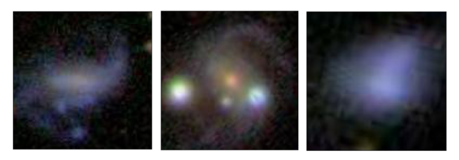

BUILD DEEP LEARNING MODELS WITH TENSORFLOW
# Classifying Galaxies Using Convolutional Neural Networks
Around the clock, telescopes affixed to orbital satellites and ground-based observatories are taking millions of pictures of millions upon millions of celestial bodies. These data, of stars, planets and galaxies provide an invaluable resource to astronomers.

However, there is a bottleneck: until the data is annotated, it’s incredibly difficult for scientists to put it to good use. Additionally, scientists are usually interested in subsets of the data, like galaxies with unique characteristics.

In this project, you will build a neural network to classify deep-space galaxies. You will be using image data curated by [Galaxy Zoo](https://www.zooniverse.org/projects/zookeeper/galaxy-zoo/), a crowd-sourced project devoted to annotating galaxies in support of scientific discovery.

You will identify “odd” properties of galaxies. The data falls into four classes:

* [1,0,0,0] - Galaxies with no identifying characteristics.


* [0,1,0,0] - Galaxies with rings.


* [0,0,1,0] - Galactic mergers.


* [0,0,0,1] - “Other,” Irregular celestial bodies.


1. Because the dataset comprises over one thousand images, you’ll use a custom function, `load_galaxy_data()` to load the compressed data files into NumPy arrays. Take a look at the shape of the data.

Use `.shape` to print the dimensions of the `input_data` and labels.

What does the last dimension of the data indicate about the image data? What does the last dimension of the labels indicate about the labels?


2. Next, divide the data into training and validation data, using `sklearn’s` `train_test_split()` function.

* Set the `test_size` argument to be 0.20.
* Shuffle the data.
* Set the `random_state` to be 222.
* Set `stratify=labels`. This ensures that ratios of galaxies in your testing data will be the same as in the original dataset.

3. Now, it’s time to preprocess the input.

Define an `ImageDataGenerator`, and configure it so that the object will normalize the pixels using the `rescale` parameter.


4. Next, create two `NumpyArrayIterators` using the `.flow(x,y,batch_size=?)` method. We recommend using a batch size of `5`. Significantly larger batch sizes may cause memory issues.

* Create a training data iterator by calling `.flow()` on your training data and labels.

* Create a validation data iterator by calling `.flow()` on your training data and labels.


5. Next, build your model, starting with the input shape and output layer.

* Create a `tf.keras.Sequential` model named `model`.
* Add a `tf.keras.Input` layer. Refer back to the shape of the data. What should the input shape be?
* Add a `tf.keras.layers.Dense` layer as your output layer. Make sure that it outputs `4` features, for the four classes (“Normal”,”Ringed”,”Merger”,”Other”).
* Remember to use a softmax activation on this final layer.

6. Before you finish designing your architecture, compile your model with an optimizer, loss, and metrics.

Use `model.compile(optimizer=?,loss=?, metrics=[?,?])` to compile your model.

* Use `tf.keras.optimizers.Adam` with a learning_rate of `0.001`.
* Because the labels are one-hot categories, use `tf.keras.losses.CategoricalCrossentropy()` as your loss.
* Set `[tf.keras.metrics.CategoricalAccuracy(),tf.keras.metrics.AUC()]` as your metrics.

7. Now, let’s go back and finish fleshing out your architecture. An architecture that works well on this task is two convolutional layers, interspersed with max pooling layers, followed by two dense layers:

    1. Conv2D: 8 filters, each 3x3 with strides of 2
    2. MaxPooling2D: pool_size=(2, 2), strides=2
    3. Conv2D: 8 filters, each 3x3 with strides of 2
    4. MaxPooling2D: pool_size=(2, 2), strides=2
    5. Flatten Layer
    6. Hidden Dense Layer with 16 hidden units
    7. Output Dense Layer
Try coding up this architecture yourself, using:
   * tf.keras.layers.Conv2D
   * tf.keras.layers.MaxPooling2D
   * tf.keras.layers.Flatten()
   * tf.keras.layers.Dense()

***Don’t forget to use “relu” activations for Dense and Conv2D hidden layers!***


8. At this point, your model should have 7,164 parameters. Use `model.summary()` to confirm this.


9. Use `model.fit(...)` to train your model.

* The first argument should be your training iterator.
* Set `steps_per_epoch` to be the length of your training data, divided by your batch size.
* Set `epochs` to be `8`.
* Set validation_data to be your validation iterator.
* Set validation_steps to be the length of your validation data, divided by your batch size.

10. Now you can run your code to train the model. Training may take a minute or two. After training for twelve epochs, your model’s accuracy should be around `0.60-0.70`, and your AUC should fall into the `0.80-0.90` range!

What do these results mean?

Your accuracy tells you that your model assigns the highest probability to the correct class **<u>more than 60% of the time</u>**. For a classification task with over four classes, this is no small feat: a random baseline model would achieve only ~25% accuracy on the dataset. Your AUC tells you that for a random galaxy, there is more than an 80% chance your model would assign a higher probability to a true class than to a false one.

11. You have successfully trained a Convolutional Neural Network to classify galaxies.

Think you can do even better? If you would like, try tweaking your architecture. Can you find a better set of hyperparameters? Make sure to watch your parameter count: it’s easy to accidentally create a model with more than tens of thousands of parameters, which could overfit to your relatively small dataset (or crash the Learning Environment).

Note that scores will fluctuate a bit, depending on how the weights are randomly initialized.

Good luck!


## Bonus
12. Want to visualize how your convolutional neural network processes images?

Take a look at `visualize.py`. It contains a function, `visualize_activations()`.

This function loads in sample data, uses your model to make predictions, and then saves the feature maps from each convolutional layer. These feature maps showcase the activations of each filter as they are convolved across the input.

Try importing this function by adding the following to the end of `train.py`:

```python
from visualize import visualize_activations
visualize_activations(model,YOUR_VALIDATION_ITERATOR)
```
And then replace YOUR_VALIDATION_ITERATOR with the `NumpyIterator` you defined in task four.

`visualize_results` takes your Keras model and the validation iterator and does the following:

* It loads in a sample batch of data using your validation iterator.
* It uses `model.predict()` to generate predictions for the first sample images.
* Next, it compares those predictions with the true labels and prints the result.
* It then saves the image and the feature maps for each convolutional layer using `matplotlib`.